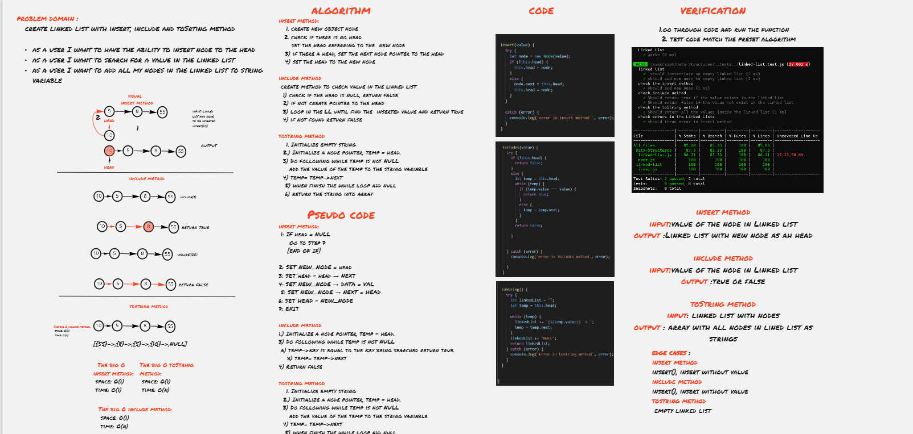

# Singly Linked Lists

A linked list is a linear data structure, in which the elements are not stored at contiguous memory locations.

**Code_Challenge 05  Linked List Implementation**

[Linked list Code](./linked-list/linked-list.js)

[node Code](./linked-list/node.js)

----------------------

## Challenge Description

create linked list with methods of:
1. insert which takes any value as an argument and adds a new node with that value to the head of the list with an O(1) Time performance.
   
 2. includes which takes any value as an argument and returns a boolean result depending on whether that value exists as a Node’s value somewhere within the list.
   
 3. toString which takes in no arguments and returns a string representing all the values in the Linked List, formatted as:
"{ a } -> { b } -> { c } -> NULL"

## White board

[whiteboard better view ](https://miro.com/app/board/o9J_lCjYNus=/)

## Approach & Efficiency

I used insert method to insert nodes to th linked list.

The big O:
- space: O(1)
- time: O(1)

I used include method to check for value at the linked list. 

The big O:
- space: O(1)
- time: O(n)

I used toString method add all nodes in the linked list to the array of strings. 

The big O:
- space: O(1)
- time: O(n) 

## API
1. Insert method pass value as argument and add nodes into the head of the linked list 

2. include method pass a value and check for it in the linked list and return true or false 

3. toSting method add all nodes in linked list to sting variable (array)
  

