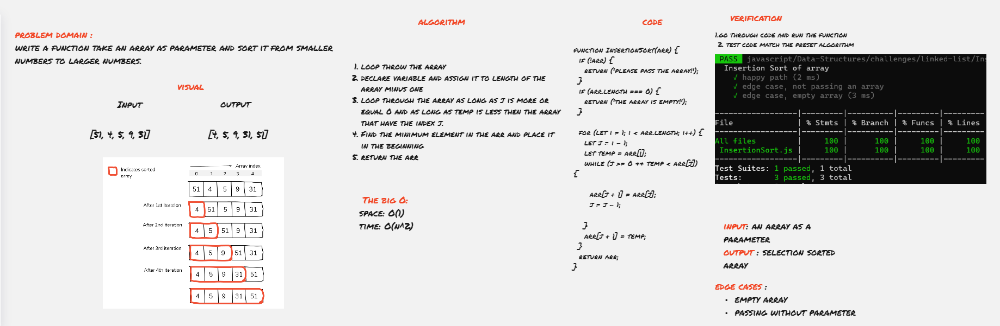

### code challenge 26 : 
# Insertion Sort 
Insertion sort is a simple sorting algorithm that builds the final sorted array.

## Challenge Summary
write a function take an array as parameter and sort it from smaller numbers to larger numbers.

Review the pseudocode below, then trace the algorithm by stepping through the process with the provided sample array. Document your explanation by creating a blog article that shows the step-by-step output after each iteration through some sort of visual.
```
 InsertionSort(int[] arr)
  
    FOR i = 1 to arr.length
    
      int j <-- i - 1
      int temp <-- arr[i]
      
      WHILE j >= 0 AND temp < arr[j]
        arr[j + 1] <-- arr[j]
        j <-- j - 1
```


## Approach & Efficiency
### big O :
- time : o(n^2)
- space : o(1)
  
 I used for loop to iterate throw the array numbers and while loop to loop until certain condition will be false, to sort the numbers and move the smallest number to the left. 


## Whiteboard 

whiteboard Clear view [click here](https://miro.com/app/board/o9J_lAeSDUw=/)
