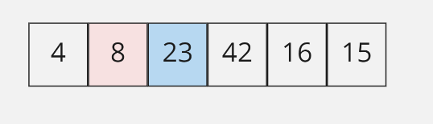

# Insertion Sort
Insertion sort is a simple sorting algorithm that builds the final sorted array.

## Pseudocode
```js

 InsertionSort(int[] arr)
  
    FOR i = 1 to arr.length
    
      int j <-- i - 1
      int temp <-- arr[i]
      
      WHILE j >= 0 AND temp < arr[j]
        arr[j + 1] <-- arr[j]
        j <-- j - 1
        
      arr[j + 1] <-- temp

```
## Trace
Sample Array: [8,4,23,42,16,15]


### Pass 1:

In the first pass we make the first number our starting point (temp )and we will compare it with the other numbers in the array
* i =1
* j = 0
* temp  = 8


### Pass 2:

In the second pass ,we compare the second number to the previous temp, and it is less so we will pace it in the beginning 
* i =2
* j = 1
* temp  = 4


### Pass 3:

In the third pass ,we compare the third number to the previous temp , and its larger so we will keep it in it place 
* i =3
* j = 2
* temp  = 23



### Pass 4:

In the fourth pass ,we compare the third number to the previous temp , and its larger so we will keep it in it place
* i = 4
* j = 3
* temp  = 42


### Pass 5:

In the fifth pass ,we compare the fifth number to the previous temp  and  it is less so we will left and compare it another time with the left and it's less, so will move it again to the left. 
* i = 5
* j = 4
* temp  = 16


### Pass 6:

In the sixth pass ,we compare the last number to the previous temp and its smaller so we will move it to the left and compare 2 times agin until the left number less than it. 
* i = 6
* j = 5
* temp  = 15


### Final result for the insertion sorted array


## Efficency
### Time: O(n^2)
The basic operation of this algorithm is comparison. This will happen n * (n-1) number of times…concluding the algorithm to be n squared.
### Space: O(1)
No additional space is being created. This array is being sorted in place…keeping the space at constant O(1).