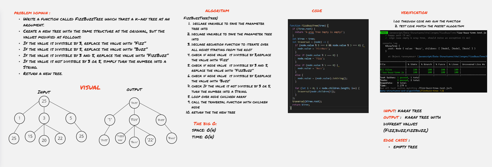

# code challenge 18: “FizzBuzz” on a k-ary tree
 Write a function called FizzBuzzTree which takes a k-ary tree as an argument.
Create a new tree with the same structure as the original, but the values modified as follows:

- If the value is divisible by 3, replace the value with “Fizz”
- If the value is divisible by 5, replace the value with “Buzz”
- If the value is divisible by 3 and 5, replace the value with “FizzBuzz”
- If the value is not divisible by 3 or 5, simply turn the number into a String.
  
  -->  Return a new tree.

## Approach & Efficiency
### fizzBuzzTree(tree) :
1. define a traverse method to traverse through the tree 
2. check every node value if it devisable by three replace the value with 'Fizz'
3. check every node value if it devisable by five replace the value with 'Buzz'
4. check every node value if it devisable by three and five replace the value with 'FizzBuzz'
5. check every node value if it non devisable by three nor five replace the value with the string of that number 
6. return the new tree.
### Big O
* time  :O ( n )
* space :O ( n )

 

## API
- fizzBuzzTree : takes in a k-ary tree and returns a tree that have the word 'Buzz' in the place of the values that are divisible by 5 , 'Fizz' in the place of the values that are divisible by 3 , and 'FizzBuzz' in place of values that are divisible by 3 and 5 , and If the value is not divisible by 3 or 5 turns the number into a String of that number.

## Whiteboard

[Whiteboard Better View ](https://miro.com/app/board/o9J_lAUbNjo=/)
