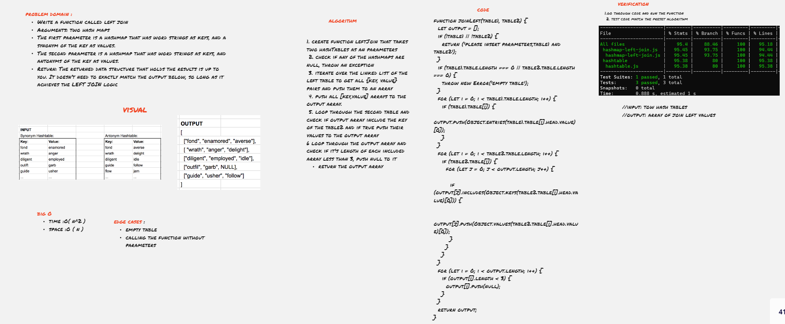

# Tree Left join 

function to return an array of arrays, each one contains  key and value of the first table and the value of matching key of the second table or null if it's not matched 

### code Summary 31 :

- Write a function called left join
    - Arguments: two hash maps
    - The first parameter is a hashmap that has word strings as keys, and a synonym of the key as values.
    - The second parameter is a hashmap that has word strings as keys, and antonyms of the key as values.
- Return: The returned data structure that holds the results is up to you. It doesn’t need to exactly match the output below, so long as it achieves the LEFT JOIN logic

## Approach & Efficiency
1. loop throw the first hash table and push to the output array all the keys and values of the left hashmap 
2. loop through the second table and check if output array include the key of the table2 and if true push their values to the output array
3. if a key in the second doesn't exist in first table push null to the array that holds the key
4. return the output array 

### big O
* time  :O( n ), worst case O(n^2)
* space :O ( n )
***

## API : Whiteboard Process

Whiteboard better view  [click here](https://miro.com/app/board/o9J_l8tgaZI=/)