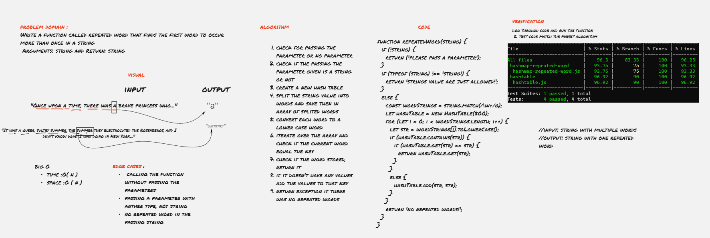

# Repeated Words 

finds the first repeated word in multiple words string using  hashtables

### code challenge :
- Write a function called repeated word that finds the first word to occur more than once in a string
 Arguments: string and Return: string

## Approach & Efficiency
- check for passing the parameter or no parameter
- check if the passing the parameter given is a string or not
- create a new hash table
- split the string value into words and save then in array of splited words
- convert each word to a lower case word
- iterate over the array and check if the current word equal the key
- check if the word stored, return it
- if it doesn't have any values add the values to that key
return exception if there were no repeated words

### big O
* time  :O( n )
* space :O ( n )
***

## API : Whiteboard Process

Whiteboard better view [click here](https://miro.com/app/board/o9J_l9VyQbg=/)