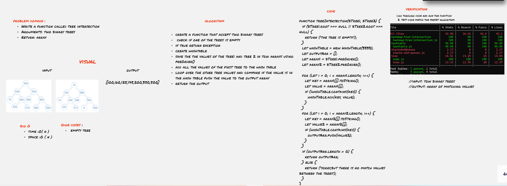

# Tree Intersection

return an array of the values of the nodes that are matching between two binary trees.

## code summary 
- Find all values found to be in 2 binary trees

- Write a function called tree intersection
    - Arguments: two binary trees
    - Return: array

## Approach & Efficiency
1. loop throw tow binary trees in  pre order and return the arrays of the nodes values 
2. add all the nodes values of the first tree to the hash table
3. loop over the second tree values and compare if the value is in the hash table push the value to the output array
4. return the output array

### big O
* time  :O( n )
* space :O ( n )
***

## API : Whiteboard Process

WhiteBoard better view [click here](https://miro.com/app/board/o9J_l8j6PV8=/)