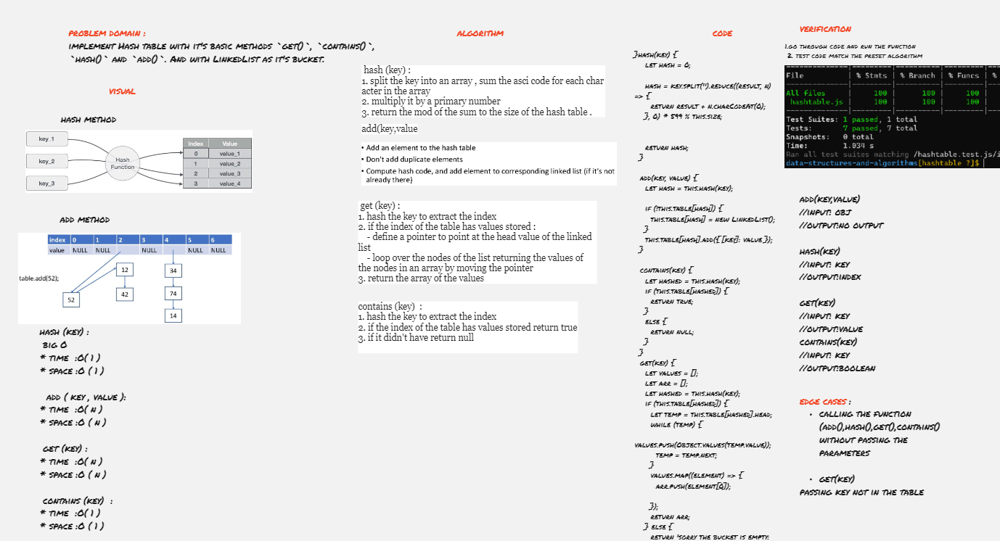

# HashTable

A hash table is a data structure that implements an associative array abstract data type, a structure that can map keys to values. A hash table uses a hash function to compute an index, also called a hash code, into an array of buckets or slots, from which the desired value can be found.

## Challenge

To implement Hash table with it's basic methods `get()`, `contains()`, `hash()` and `add()`. And with LinkedList as it's bucket.

## Whiteboard

Whiteboard better view [click here](https://miro.com/app/board/o9J_l9zTtdE=/)

## Approach & Efficiency

### hash (key) :

### big O
* time  :O( 1 )
* space :O ( 1 )

###  add ( key , value ):

* time  :O( n )
* space :O ( n )

### get (key) :

### big O
* time  :O( n )
* space :O ( n )

### contains (key)  :

### big O
* time  :O( 1 )
* space :O ( 1 )
## API

- add: takes in both the key and value. This method should hash the key, and add the key and value pair to the table, handling collisions as needed.
- get: takes in the key and returns the value from the table.
- contains: takes in the key and returns a boolean, indicating if the key exists in the table already.
- hash: takes in an arbitrary key and returns an index in the collection.