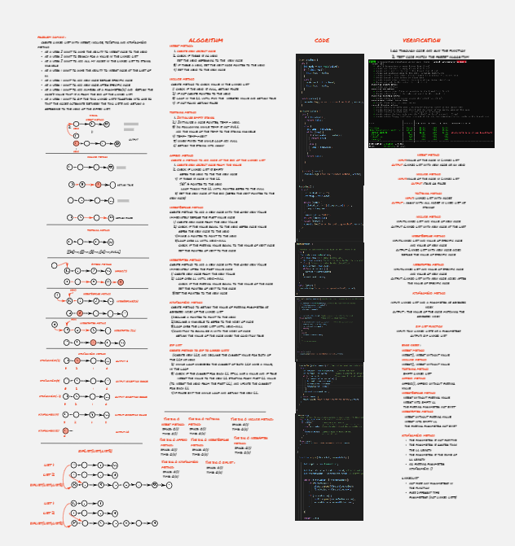

# Singly Linked Lists

A linked list is a linear data structure, in which the elements are not stored at contiguous memory locations.

[Linked list Code](./linked-list/linked-list1.js)

[node Code](./linked-list/node.js)

----------------------

## Challenge Description

create linked list with methods of:
1. insert which takes any value as an argument and adds a new node with that value to the head of the list with an O(1) Time performance.
   
 2. includes which takes any value as an argument and returns a boolean result depending on whether that value exists as a Node’s value somewhere within the list.
   
 3. toString which takes in no arguments and returns a string representing all the values in the Linked List, formatted as:
"{ a } -> { b } -> { c } -> NULL"

4.  append(value) which adds a new node with the given value to the end of the list
5.  insertBefore(value, newVal) which add a new node with the given newValue immediately before the first value node

6.  insertAfter(value, newVal) which add a new node with the given newValue immediately after the first value node
   
7.  kthFromEnd(k) which add number as a parameter(k) and Return the node’s value that is k from the end of the linked list.
8.  zipLists(list1, list2) which  takes two linked lists as arguments. Zip the two linked lists together into one so that the nodes alternate between the two lists and return a reference to the head of the zipped list. 

## White board

[whiteboard better view ](https://miro.com/app/board/o9J_lCM8pus=/)

## Approach & Efficiency

I used insert method to insert nodes to th linked list.

The big O:
- space: O(1)
- time: O(1)

I used include method to check for value at the linked list. 

The big O:
- space: O(1)
- time: O(n)

I used toString method add all nodes in the linked list to the array of strings. 

The big O:
- space: O(1)
- time: O(n) 
  

  I used append method to insert node at the end of th linked list.

The big O:
- space: O(1)
- time: O(n)

I used insertBefore method to insert node before specific node 

The big O:
- space: O(1)
- time: O(n)

I used insertAfter method to insert node after specific node 

The big O:
- space: O(1)
- time: O(n)

I used kthFromEnd(k) method to return the value of passing parameter as reversed index of the linked list 

The big O:
- space: O(1)
- time: O(n)
  

I used zipLL function to return one zipped list from tow linked list 
- space: O(1)
- time: O(n)

## API
1. Insert method pass value as argument and add nodes into the head of the linked list 

2. include method pass a value and check for it in the linked list and return true or false 

3. toSting method add all nodes in linked list to sting variable (array)
4.  append method pass value as argument and add nodes at the last of the linked list 
5. insertBefore method pass the value and new value as arguments and insert  new node before the value of passing node 
6. insertAfter method pass the value and new value as arguments and insert new node after the value of passing node
7. kthFromEnd method pass a reversed index as argument and return the value of the matching node
8. zipLists: takes in two linked lists as arguments and returns zip linked list with both lists nodes alternating.
  

