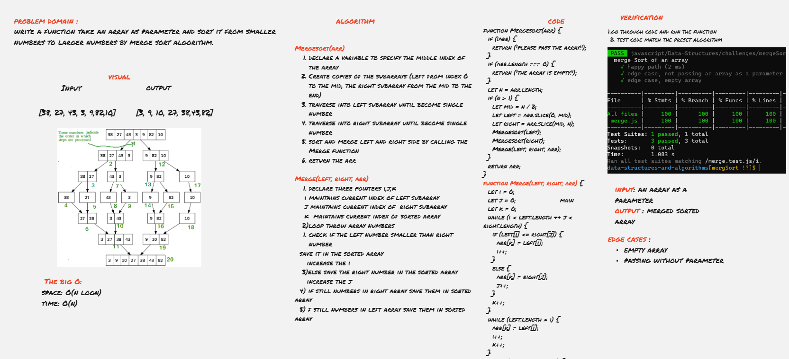

# Merge Sort 
a function takes in an array as a parameter and return it sorted from smaller to the larger numbers by merge sorting algorithm

## Challenge Summary
Review the pseudocode below, then trace the algorithm by stepping through the process with the provided sample array. Document your explanation by creating a blog article that shows the step-by-step output after each iteration through some sort of visual.
```
 ALGORITHM Mergesort(arr)
    DECLARE n <-- arr.length
           
    if n > 1
      DECLARE mid <-- n/2
      DECLARE left <-- arr[0...mid]
      DECLARE right <-- arr[mid...n]
      // sort the left side
      Mergesort(left)
      // sort the right side
      Mergesort(right)
      // merge the sorted left and right sides together
      Merge(left, right, arr)

ALGORITHM Merge(left, right, arr)
    DECLARE i <-- 0
    DECLARE j <-- 0
    DECLARE k <-- 0

    while i < left.length && j < right.length
        if left[i] <= right[j]
            arr[k] <-- left[i]
            i <-- i + 1
        else
            arr[k] <-- right[j]
            j <-- j + 1
            
        k <-- k + 1

    if i = left.length
       set remaining entries in arr to remaining values in right
    else
       set remaining entries in arr to remaining values in left

```


## Approach & Efficiency
### big O :
- time : o(n log n)
- space : o(n)
- 
I used tow functions to return the array sorted and achieved complexity of time O (n log n), Mergesort function for divide the array to tow arrays and traverse the function until every number will be sorted in an array.
and merge function to sort the divided arrays into one sorted array.   

## Whiteboard 

Whiteboard better view [click here](https://miro.com/app/board/o9J_l-b4u_4=/)

