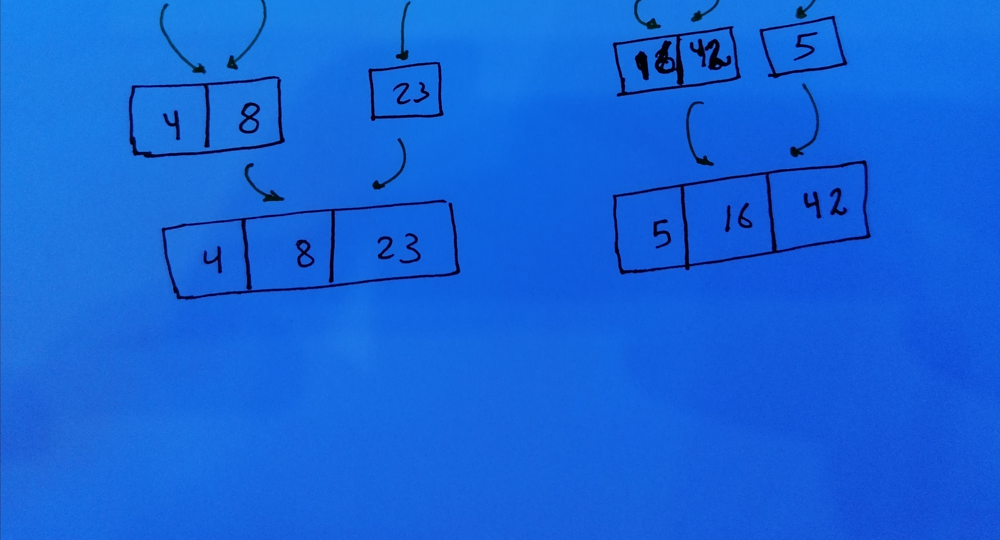

# Merge Sort
Is an efficient, general-purpose, and comparison-based sorting algorithm. Most implementations produce a stable sort, which means that the order of equal elements is the same in the input and output.

## Pseudocode
```js

 InsertionSort(int[] arr)
  
 
ALGORITHM Mergesort(arr)
    DECLARE n <-- arr.length
           
    if n > 1
      DECLARE mid <-- n/2
      DECLARE left <-- arr[0...mid]
      DECLARE right <-- arr[mid...n]
      // sort the left side
      Mergesort(left)
      // sort the right side
      Mergesort(right)
      // merge the sorted left and right sides together
      Merge(left, right, arr)

ALGORITHM Merge(left, right, arr)
    DECLARE i <-- 0
    DECLARE j <-- 0
    DECLARE k <-- 0

    while i < left.length && j < right.length
        if left[i] <= right[j]
            arr[k] <-- left[i]
            i <-- i + 1
        else
            arr[k] <-- right[j]
            j <-- j + 1
            
        k <-- k + 1

    if i = left.length
       set remaining entries in arr to remaining values in right
    else
       set remaining entries in arr to remaining values in left


```
## Trace
Sample Array: [8,4,23,42,16,15]

### Pass 1:
divide the array  [8,4,23,42,16,15] into tow sub arrays


### Pass 2:
divide the two arrays to another tow arrays 


### Pass 3:
divide the arrays into array with one number


### Pass 4:
merge the tow arrays into one sorted array


### Pass 5:
merge the tow arrays into one sorted array from the previous step




### Pass 6:
merge the tow arrays into one sorted array from the previous step


### THE WHOLE PROCESS


## Efficiency
### Time: O(n log n)
recursive functions take less time than other methods 
### Space: O(n)
The array sorted with a space at  O(n).