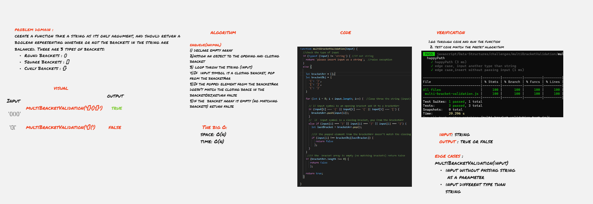

# Multi-bracket Validation.

## Challenge description

create a function take a string as its only argument, and should return a boolean representing whether or not the brackets in the string are balanced. There are 3 types of brackets:

- Round Brackets : ()
- Square Brackets : []
* Curly Brackets : {}

## Approach & Efficiency
I implement a function,it will take the input parameter as string and then loop over each index of the string and check the brackets.
I used an array as a data structure and I used the array method push & pop

  **The big O**

 
- space: O(n)
- time: O(n)
  
 

  

## API

multiBracketValidation(input) : takes in a string as an input and returns a boolean indicating if all the brackets and braces are closed after opening.

### Whiteboard

[Whiteboard better view](https://miro.com/app/board/o9J_lBNHCwA=/)

