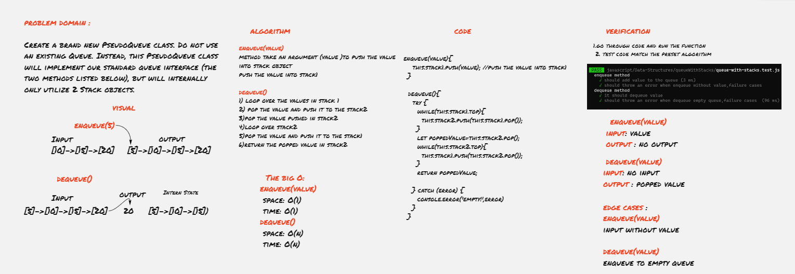

# Stacks with Queues
Stack is a container of objects that are inserted and removed according to the last-in first-out (LIFO) principle.

Queue is a container of objects (a linear collection) that are inserted and removed according to the first-in first-out (FIFO) principle.

## Challenge description
make an implementation for queue with tow stack 
## Approach & Efficiency
I developed the queue with tow stacks and I applied enqueue(value) and dequeue() methods 
  

  **The big O**

  **enqueue(value)**
- space: O(1)
- time: O(1)
  
  **dequeue()**
- space: O(n)
- time: O(n)

  

## API

**enqueue(value)** method to insert value into the PseudoQueue, using a first-in, first-out approach.

 
  
**dequeue()**
method to extract a value from the PseudoQueue, using a first-in, first-out approach.

### whiteboard

[white board better view](https://miro.com/app/board/o9J_lB3_UZE=/)

