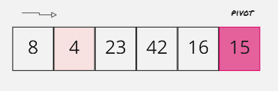
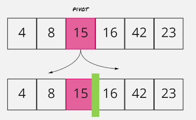

# Quick Sort
***Quicksort*** :  is a divide-and-conquer algorithm. It works by selecting a 'pivot' element from the array and partitioning the other elements into two sub-arrays, according to whether they are less than or greater than the pivot. For this reason, it is sometimes called partition-exchange sort.
## Pseudocode
```js

 ALGORITHM QuickSort(arr, left, right)
    if left < right
        // Partition the array by setting the position of the pivot value 
        DEFINE position <-- Partition(arr, left, right)
        // Sort the left
        QuickSort(arr, left, position - 1)
        // Sort the right
        QuickSort(arr, position + 1, right)

ALGORITHM Partition(arr, left, right)
    // set a pivot value as a point of reference
    DEFINE pivot <-- arr[right]
    // create a variable to track the largest index of numbers lower than the defined pivot
    DEFINE low <-- left - 1
    for i <- left to right do
        if arr[i] <= pivot
            low++
            Swap(arr, i, low)

     // place the value of the pivot location in the middle.
     // all numbers smaller than the pivot are on the left, larger on the right. 
     Swap(arr, right, low + 1)
    // return the pivot index point
     return low + 1

ALGORITHM Swap(arr, i, low)
    DEFINE temp;
    temp <-- arr[i]
    arr[i] <-- arr[low]
    arr[low] <-- temp

```
## Trace


### Pass 1:
 set the pivot to be the last element of the array (15)
 and declare pointer to point to the first element of the array which is 8
 

### Pass 2:
 

compare the pivot (15) with pointer(8)and since the 8<15,don't move the pivot and increase the pointer 

 

### Pass 3:
compare the pivot (15) with pointer(4)and since the 4<15,don't move the pivot and increase the pointer 

 


### Pass 4:

compare the pivot (15) with pointer(23),and since 23>15, swap the places, now the 15 in the right place 

 

### Pass 5:
we divide the array to to section 
and we have the left section of the array sorted 


 

### Pass 6:
now we make the pivot of the right section as a last element which is 23

 

### Pass 7:
compare the pivot (23) with pointer(16),and the 16<23,don't move the pivot and increase the pointer 

 

 ### Pass 8:

compare the pivot (23) with pointer(42),and since 24>23, swap the places, now the 23 in the right place and the right section is sorted also 
 
 
  


### last result 
  

### The whole process:
   


## Efficiency
### Time: O(n log n)
recursive functions along side with more then one while loop so it takes less time 
### Space: O(1)
No additional space is being created.keeping the space at constant O(1).