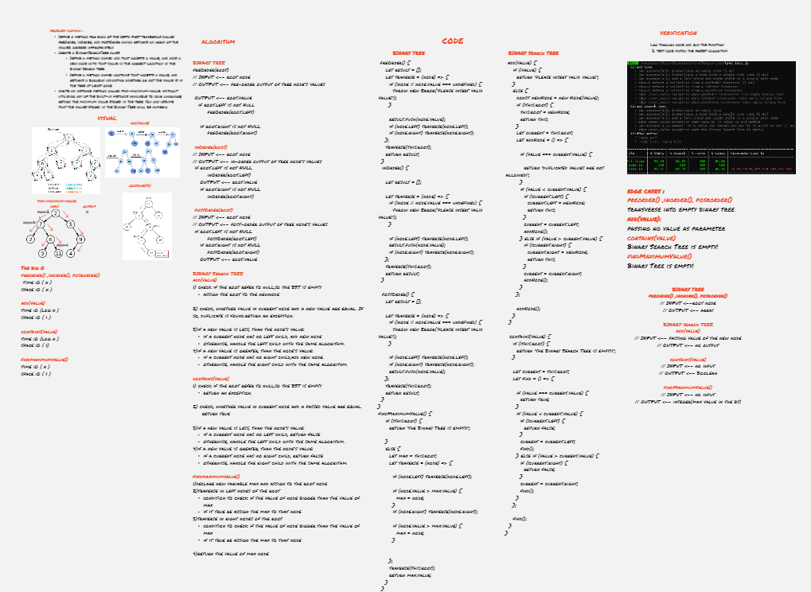
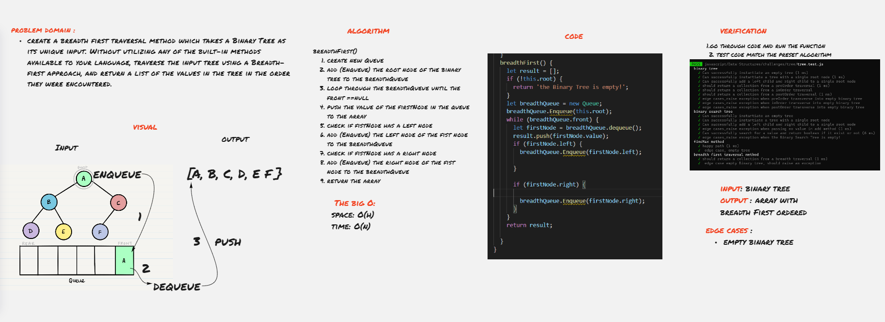

# Tree
is a non-linear data structure because it does not store in a sequential manner. It is a hierarchical structure as elements in a Tree are arranged in multiple levels. In the Tree data structure, the topmost node is known as a root node. Each node contains some data, and data can be of any type.

### Challenge

- To create BinaryTree and traverse with InOrder, PreOrder and PostOrder methods.
* To create BinarySearchTree with add(value) and contains(value) methods.
* To create method return the maximum value stored in the binary tree. 
* To create method to traverse the input tree using a Breadth-first approach, and return a list of the values in the tree in the order they were encountered.
 
### Approach & Efficiency

#### BinaryTree
- preOrder(): space O(h)time O(n)
- inOrder(): space O(h)/time O(n)
- postOrder(): space O(h)/time O(n)
- findMaximumBinaryTree(): space O(h)/time O(1)
- breadthFirst(): space O(h)/time O(n)

  

#### BinarySearchTree
 add(value):
-  space O(1)
- time O(log n)
  
contain(value):
* space O(1)
* time O(log n)

### API

The BinaryTree methods:
1. **`preOrder()`** To traverse the nodes and return the values in order of root/left/right in an array.
2. **`inOrder()`** To traverse the nodes and return the values in order of left/root/right in an array
3. **`postOrder()`**  To traverse the nodes and return the values in order of left/right/root in an array
4. **`findMaximumBinaryTree()`** return the maximum value stored in the numeric tree
5. **`breadthFirst()`** traversal method which takes a Binary Tree as its unique input. return a list of the values in the tree in the order they were encountered.

The BinarySearchTree methods:
1. **`add(value)`** method that accepts a value, and adds a new node with that value in the correct location in the binary search tree.
2. **`contains(value)`**  method that accepts a value, and returns a boolean indicating whether or not the value is in the tree at least once.

 **Whiteboard**

[whiteboard Better View, click here!](https://miro.com/app/board/o9J_lA7Dlbg=/)

**challenge 17 Whiteboard**

[whiteboard Better View, click here!](https://miro.com/app/board/o9J_lBNHCwA=/)
