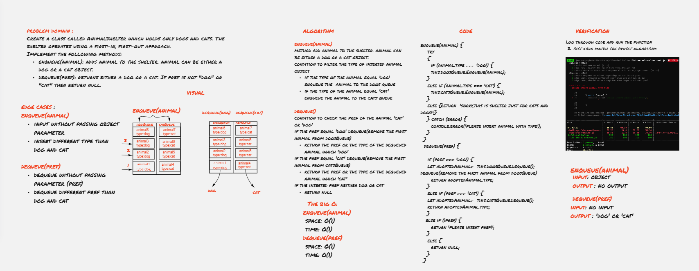

# First-in, First out Animal Shelter.

Queue is a container of objects (a linear collection) that are inserted and removed according to the first-in first-out (FIFO) principle.

## Challenge description

Create a class called AnimalShelter which holds only dogs and cats. The shelter operates using a first-in, first-out approach.

## Approach & Efficiency
I developed the an queue with tow queues and I applied enqueue(animal) and dequeue(pref) methods.
  

  **The big O**

  **enqueue(animal)**
- space: O(1)
- time: O(1)
  
  **dequeue(pref)**
- space: O(1)
- time: O(1)

  

## API

**enqueue(animal)** method to add animal to the shelter. animal can be either a dog or a cat object,using a first-in, first-out approach.
 

 
  
**dequeue(pref)**
method to return either a dog or a cat. If pref is not "dog" or "cat" then return null.using a first-in, first-out approach.

### Whiteboard

[Whiteboard better view](https://miro.com/app/board/o9J_lB8OYew=/)

