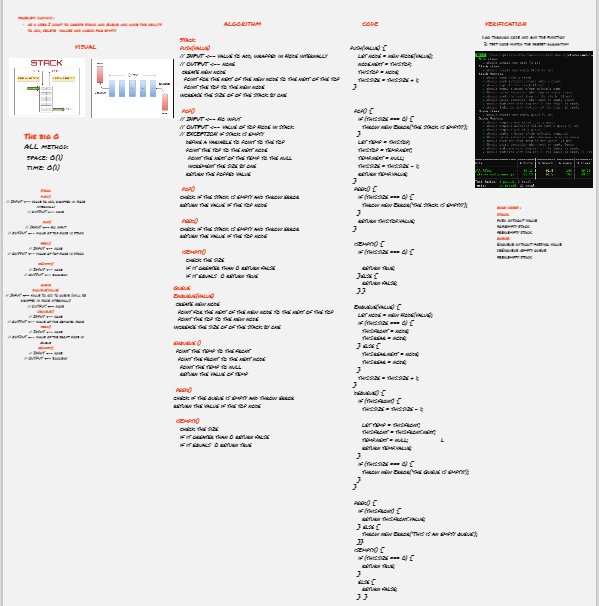

# Stacks and Queues
Stack is a container of objects that are inserted and removed according to the last-in first-out (LIFO) principle.

Queue is a container of objects (a linear collection) that are inserted and removed according to the first-in first-out (FIFO) principle.

## Challenge description
make an implementation for stack and queue data structures and develop them as a singly linked list

## Approach & Efficiency
I developed the stack and queue and I applied push,pop,peek,isEmpty to the Stack and enqueue,dequeue,peek,isEmpty to the Queue
  

  **All the method The big O:**
- space: O(1)
- time: O(1)

## API

### STACK
**push(value)** method to add value to the top of the stack

 
  
**pop()** method to remove value from the top of the stack, and return the removed value, and raise an exception if the stack is empty

 
**peek()** method to return the top value of the stack and raise exception if the stack is empty.

**isEmpty()**  method to check if the stack empty and return boolean.

### Queue
**enqueue** method  takes any value as an argument and adds a new node with that value to the back of the queue

  
**dequeue()** method to remove the node from the front of the queue, and returns the node’s value.
Should raise exception when called on empty queue

**peek()** method to return the value of the node located in the front of the queue, without removing it from the queue.
Should raise exception when called on empty queue.

**isEmpty()**  method to return a boolean indicating whether or not the queue is empty.

### white board

[white board better view](https://miro.com/app/board/o9J_lByGkCA=/)

