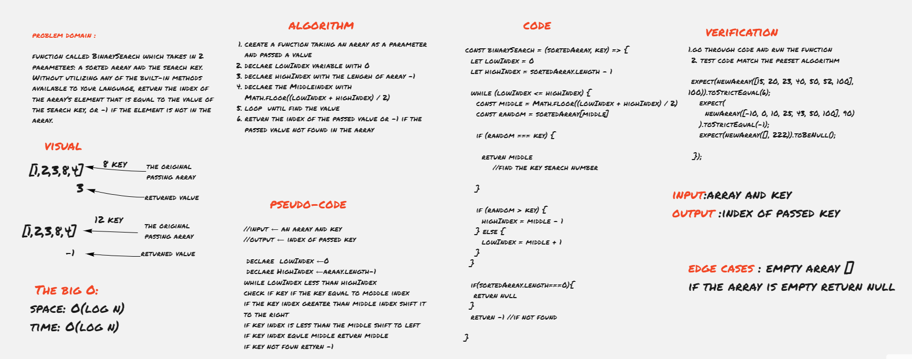

# Binary Search of Sorted Array

**Code_Challenge 03 //array-binary-search**

[array-binary Code](./array-binary-search.js)

----------------------

## Challenge Description
function called BinarySearch which takes in 2 parameters: a sorted array and the search key. Without utilizing any of the built-in methods available to your language, return the index of the array’s element that is equal to the value of the search key, or -1 if the element is not in the array.

## White board

[whiteboard](https://miro.com/app/board/o9J_lDne1tw=/)

## Approach & Efficiency

I used multi conditions and while loop to avoid using built in methods 

The big O:
- space: O(log n)
- time: O(log n)
