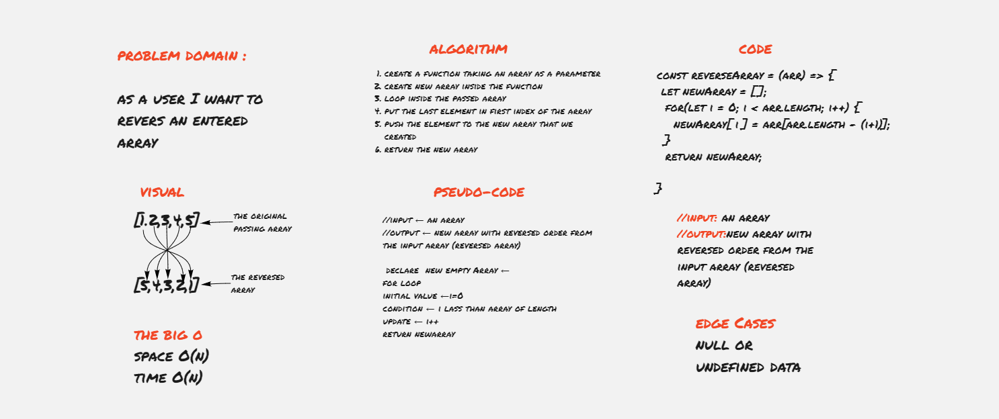

# Reverse an Array
 changes the sequence of elements of the given array and returns the reverse sequence. In other words, the arrays last element becomes first and the first element becomes the last. This method also made the changes in the original array.

----------------------

## Challenge Description
 function called reverseArray which takes an array as an argument. Without utilizing any of the built-in methods available to your language, return an array with elements in reversed order.

## White board

[whitebord link](https://miro.com/app/board/o9J_lCnSMvM=/)

## Approach & Efficiency

I used for loop to avoid using built in methods.

The big O:
- space: O(n)
- time: O(n)

