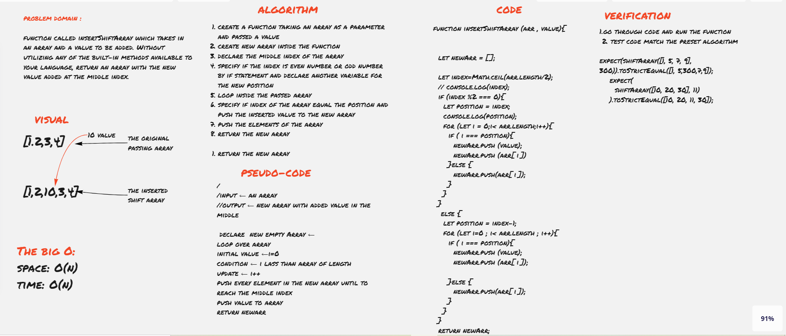

# Insert to Middle of an Array

**Code_Challenge 02 // array-shift**

[array-shift Code](./../array-shif/insert-shift-array.js)

----------------------

## Challenge Description
function called insertShiftArray which takes in an array and a value to be added. Without utilizing any of the built-in methods available to your language, return an array with the new value added at the middle index.

## White board

[whiteboard](https://miro.com/app/board/o9J_lDne1tw=/)

## Approach & Efficiency

I used multi conditions and for loop to avoid using built in methods 

The big O:
- space: O(n)
- time: O(n)

